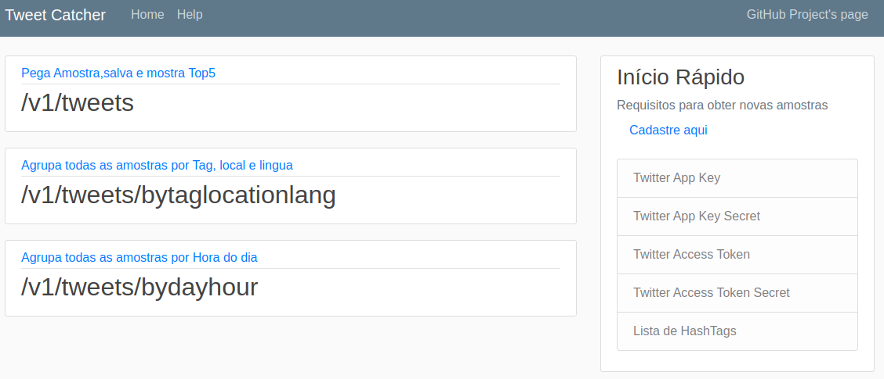

# Tweetcatcher
Pesquise e armazene centenas de tweets

https://hub.docker.com/repository/docker/atilaloise/tweetcatcher

docker pull atilaloise/tweetcatcher

# Resumo

Essa aplicação fornece uma API local e uma interface Web para interagir com a API de buscas do Twitter.

Através de requisições a API do twitter, esta aplicação busca por tweets que contenham determinadas hashtags.

Para isso, utiliza-se chaves de acesso a API e com o sucesso da interação, é retornado o top5 Tweets para cada
hashtag informada na busca, conforme a quantidade de seguidores do usuário que postou.

Toda a amostra coletada nessa interação é armazenada em um banco de dados MongoDb local.

A API local também fornece dois modelos de busca na base de dados local. Sendo contadores de tweets 
por Hashtags/Localização/Linguagem e contadores por Hora do dia.

# Estrutura do projeto
```
.
├── Docker                      "Tudo que é relacionado ao ambiente docker "
│   ├── apm-server              "Configurações do APM server"
│   │   └── apm-server.yml      "O arquivo de configuração do APM server"
│   └── docker-compose.yml      "Declaração do ambiente completo da aplicação e seu monitoramento para uso com docker-compose"
├── Dockerfile                  "Dockerfile para geração da imagem docker da aplicação"
├── LICENSE                     "GNU license"
├── Project                     "Documentos, formalização e demais informações relacionadas ao projeto"
│   ├── architecture.md         "Documento de definição da arquitetura da aplicação"
│   ├── assets                  "Arquivos utilizados na documentação"
│   │   └── architecture.jpg    "Ilustração da arquitetura"
│   └── planoDeTrabalho.md      "O plano de trabalho"
├── README.md                   ("Este arquivo. :P")
└── src                         "Codigos da aplicação"
    └── api
        ├── api.py              "Arquivo principal do app"
        ├── __init__.py         "Inicialização do app como modulo"
        ├── libs                "Modulos utilizados pelo app"
        │   ├── handler         "Handlers pra funções específicas do app"
        │   │   ├── forms.py    "Classe para gerar e cuidar dos formularios do app"
        │   │   ├── get_from_db.py  "Classe que interage com o banco de dados local"
        │   │   ├── get_tweet.py    "classe que interage com a API do Twitter e grava dados no banco de dados
        │   │   ├── __init__.py     "MOdularização dos handlers"
        │   └── model               "Modelos utilizados no app"
        │       ├── db_model.py     "Modelo da base de dados que armazena os tweets"
        │       ├── __init__.py     "Modularização dos modelos"
        ├── requirements.txt        "Modulos python necessários para rodar o app"
        ├── static                  "arquivos estáticos"
        │   └── main.css            "Css local para melhor design da interface Web"
        └── templates               "Templates Jinja2 utilizados para renderizar a Interface Web"
            ├── credentials.htm     "Pagina que mostra o formulario de credenciais para interagir com a api do Twitter"
            ├── help.htm            "Exibe este arquivo na interface web"
            ├── index.htm           "Pagina principal do app"
            └── layout.htm          "Layout padrão da interface web"

````

# Utilizando o app
## Requisitos
### Credenciais de app do Twitter
Ainda que para buscas simples. o Twitter exige que sejam utilizadas credenciais para conectar-se a sua API.

Para Gerar essas credenciais, acesse `https://developer.twitter.com/en/apps`

Clique no seu nome de usuario e em seguida em `Apps`


Clique em `Create App` preencha todas as informações e finalize o processo.

Na tela de configurações do seu App vá até `Keys and tokens`


Copie Sua Api Key e Api Secret Key, juntamente com o Access Token e o Acces Token Secret.

## Subindo a aplicação
### Requisitos

Para executar a aplicação e seus componentes para monitoramento é necessário que você possua `docker` Instalado na sua máquina juntamente com o `docker-compose`

Siga os procedimentos de instalação adequados para seu sistema conforme a documentação oficial em `https://docs.docker.com/install/`

### Componentes

- mongoDB
- TweetCatcher app
- Elastic APM server
- Elastic Search
- KIBANA

## Build
A imagem docker do app está disponível no dockerHub.

Se desejar fazer um build local, utilize o comando `docker build -t tweetcatcher .` na raiz do projeto.

### Deploy

Clone esse repositório para sua maquina local e em seguida acesse a pasta [Docker](/Docker/) via terminal.

Cerifique-se que as configurações do APM server tem as permissões de escrita, forçando isso com o comando `chmod go-w Docker/apm-server/apm-server.yml`

Em seguida execute o comando `docker-compose up`

Acompanhe os logs e aguarde todos os componentes inicializarem.

#### Troubleshooting
Talvez seja necessário alterar o parâmetro vm.max_map_count do seu sistema para que os componentes de monitoramento funcionem corretamente.
No linux utilize os comandos 

`sysctl -w vm.max_map_count="262144"`

`sysctl --system`

## Utilizando Aplicação

Após inicialização dos componentes, acesse via navegador o endereço `http://localhost:8000`



Clique em `Cadastre aqui` na área de inicio rápido para preencher o formulário com suas credenciais de interação com a api do Twitter.


Preencha o formulario corretamente e insira as hashtags que deseja pesquisar, separadas por espaços.

Clique em registrar e seja redirecionado para pagina inicial onde você pode clicar na rota `v1/tweets` e receber um payload com o top5 Tweets postados por usuarios com mais seguidores, agrupados por hashtag

por exemplo:

#openbanking #apifirst #devops cloudfirst #microservices #apigateway #oauth #swagger #raml #openapis

### Enviando Payload para api

Caso prefira utilizar a api local diretamente, utilize o payload abaixo como referencia juntamente com o metodo POST para http://localhost:8000/v1/tweets


{
"TWITTER_APP_KEY": "YezipOoweQ3FbSgyRihKZ5BbZ",
"TWITTER_APP_KEY_SECRET": "tWRn9kkswLkxbXK78aOuHbxvb7C1BG3SFZDfxVDHgIdLqkFkTy",
"TWITTER_ACCESS_TOKEN": "1237878615942946818-BY4593QtzNK0Ryig8Jh203c8Stq7DO",
"TWITTER_ACCESS_TOKEN_SECRET": "gjlTPvFbNlGYnGh7011lgyjf8oiWOASSmp244Kce1KZ6S",
"hashtags": ["#swagger", "#devops","#cloudfirst"]
}


## A resposta deve ser algo como a imagem abaixo


## Consultando amostras na base de dados local
Sempre que uma requisição é feita na rota `/v1/tweets`, até 100 tweets por hashtag são armazenados na base de dados locais para consulta posterior.

### Buscando tweets por tag, local e linguagem

A rota `/v1/tweets/bytaglocationlang` retornará um totalizador de tweets por hashtag, linguagem e localização.
caso desejar interagir diretamente, utilize o metodo GET


### Buscando tweets por tag, local e linguagem

A rota `/v1/tweets/bytaglocationlang` retornará um totalizador de tweets por hashtag, linguagem e localização.
caso desejar interagir diretamente, utilize o metodo GET


# Visualizando métricas

Acesse o kibana em `http://localhost:5601`

Clique em `APM` no menu esquerdo
Em seguida selecione a aplicação `tweetcatcher`
Visualize metricas em graficos, por componente, rota e tipo de evento

 


Para gerar um evento de erro, faça um POST para rota `/v1/tweets` sem informar as chaves de acesso da api do Twitter

 

